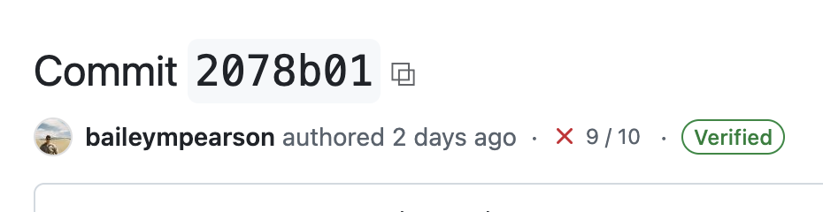

# Pavel's MongoDB Tools

This is a growing repo of Pavel's MongoDB tools/scripts.

## Tampermonkey

One of the few consistent uses of AI for me is the creation of Tampermonkey scripts. This seems like a good task for AI, and it's super-easy to verify that things work.

So with that, I've been modifying my web experience at work by creating these small Tampermonkey improvements.

### Copy Title

[Copy Title](tampermonkey/copy-title/readme.md) is a script that adds a little `⧉` to headers. Click this button and the name of the header and the url is copied into the clipboard and can be pasted into:

1. Google Docs as the title linked to the page
2. Plaintext Markdown of the format `[title](url)` will be pasted into other editors

### GH Evergreen links open in new tab

[GH Evergreen New Tab](tampermonkey/gh-evergreen-new-tab/readme.md) is a script makes all evergreen.mongodb.com links in GitHub open into a new tab.
